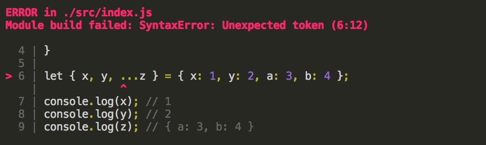

Babel使用
====

Babel可以将ES6代码转为ES5代码，从而在大多数 JavaScript 环境下执行。

首先需要添加 `babel-loader` 到 module 的 loaders 列表。

需要安装`babel-core`、`babel-loader`: `npm i --save-dev babel-core babel-loader`，添加 `module` 选项并加入`babel-loader`配置：

``` js
/* webpack.base.conf.js */
module.exports = {
  // ...
  module: {
    rules: [
      {
        test: /\.js$/,
        loader: 'babel-loader',
        include: [resolve('src'), resolve('test')]
      }
    ]
  }
  // ...
}

```

Babel 默认什么也不做，需要添加安装并配置插件（plugins）或预设（presets，即一组插件）。`.babelrc` 文件是给 Babel 传递配置选项最好的方式。

es5 是现今在大多数 JavaScript 环境下可用的版本，首先做es6转es5的配置，配置如下

安装 "es2015" Babel 预设： `npm i --save-dev babel-preset-es2015`

``` json
{
  "presets": [
    "es2015"
  ],
  "plugins": []
}
```

如此一来es6语法已经可以转换为es5，如箭头函数会被编译成匿名函数

**支持 JavaScript提案的编译**

JavaScript 还有一些提案，正在积极通过 TC39（ECMAScript 标准背后的技术委员会）的流程成为标准的一部分。

这个流程分为 5（0－4）个阶段。 随着提案得到越多的关注就越有可能被标准采纳，于是他们就继续通过各个阶段，最终在阶段 4 被标准正式采纳

> 注意 stage-4 预设是不存在的, 因为它就是上面的 es2015 预设

以上每种预设都依赖于紧随的后期阶段预设。例如，babel-preset-stage-1 依赖 babel-preset-stage-2，后者又依赖 babel-preset-stage-3。

也就是说 babel-preset-stage-1 包含了 babel-preset-stage-2， babel-preset-stage-2 包含了 babel-preset-stage-3

使用的时候只需要安装你想要的阶段就可以了，eg `npm install --save-dev babel-preset-stage-2`

这里我们先安装`babel-preset-stage-2`, 配置如下

``` json
{
  "presets": [
    "es2015",
    "stage-2"
  ],
  "plugins": []
}
```

stage-2 支持 扩展运算符，我们在`src/index.js`中添加

``` js
let { x, y, ...z } = { x: 1, y: 2, a: 3, b: 4 };
console.log(x); // 1
console.log(y); // 2
console.log(z); // { a: 3, b: 4 }
```

发现在 presets 选项只添加了`"es2015"`时无法编译，webpack会在终端显示`SyntaxError: Unexpected token` 的错误，无法识别 `...`运算符：




添加`"stage-2"`后就可以成功编译了

Babel 转译后的代码需要借助一些helper函数, 并且可能在多个文件中重复定义而导致编译后的代码体积变大。

**transform-runtime**

Babel 转译后的代码要实现源代码同样的功能需要借助一些帮助函数（helper），例如: `{ [name]: 'JavaScript' }` 转译后的代码如下所示：


``` js
'use strict';
function _defineProperty(obj, key, value) {
  if (key in obj) {
    Object.defineProperty(obj, key, {
      value: value,
      enumerable: true,
      configurable: true,
      writable: true
    });
  } else {
    obj[key] = value;
  }
  return obj;
}
var obj = _defineProperty({}, 'name', 'JavaScript');
```

类似上面的`_defineProperty`就是一个helper函数，默认情况下，这些helper函数的代码会包含在编译后的文件中。如果存在多个文件，那每个文件都有可能含有一份重复的代码。

`babel-runtime` 就是为了减少这些重复代码而生的，里面包含了所有的helper函数，而`babel-plugin-transform-runtime`可以使Babel编译代码过程中需要用 `helper` 转化时，将这些helper函数的代码转换成`require`语句并插入到编译后文件的顶部，指向为对`babel-runtime`的引用，如 `require('babel-runtime/helpers/classCallCheck')`。这样`classCallCheck`的代码就不需要在每个文件中都存在了。

当然，最终你需要利用webpack之类的打包工具，将`runtime`代码打包到目标文件中。所以`babel-runtime`需要作为生产依赖（--save），`babel-plugin-transform-runtime`作为开发依赖项（--save-dev）进行安装。

`babel-runtime` 和 `babel-plugin-transform-runtime` 一般都是一起使用的，我们可以称为 `transform-runtime`，`transform-runtime`减少重复的代码，还可以按需引入使用到的helper函数，但它有个**缺陷就是实例方法不能正常工作。**


添加`presets`相当于添加多个`plugins`的套餐，比配置大量的插件显得简单很多，但官方更推荐使用`babel-preset-env`。`babel-preset-env`本身包含了很多插件，并且可以根据我们指定的运行环境自动激活必要的插件和添加`polyfills`。示例如下：

``` json
{
  "presets": [
    ["env", {
      "useBuiltIns": true,
      "debug": true,
      "targets": {
        "browsers": [
          "> 1%",
          "last 2 versions",
          "not ie <= 8"
        ]
      },
      "modules": false
    }]
  ]
}
```

`babel-preset-env`虽然包含了很多插件，但不包含`polyfill`, 如果需要根据预设自动添加`polyfills`，首先我们需要开启`useBuiltIns: true`, 然后我们需要安装polyfills，这里可以使用`babel-polyfill`：

安装该polyfill: `npm install babel-polyfill --save`, 激活: 在入口js顶部`import 'babel-polyfill'`。

如果你选择添加到webpack`entry`中，像这样：

``` js
entry: {
  index: ['babel-polyfill', './src/index.js']
},
```

useBuiltIns选项会失效，相当于整个引入了`babel-polyfill`。

值得一提的是开启`useBuiltIns`，虽然可以根据运行环境剔除掉不需要polyfill，但也可能添加了一些你不需要的polyfill。 毕竟它不是根据实际代码中的使用情况去剔除的。

`debug`选项会在编译时输出以下信息：目标环境、使用的的转换规则、使用的插件、使用的polyfill

`modules`是配置你想要将ES6模块编译为哪一种模块系统，有"amd", "commonjs", "systemjs", "umd", 如果不编译, 还是使用ES6模块系统, 则将值声明为false。这里也是考虑到为后面webpack的一些优化配置，必须设置为false，如js作用域提升以优化js运行速度，后面会讲到。

``` json
{
  "presets": [
    ["env", {
      "useBuiltIns": true,
      "debug": true,
      "targets": {
        "browsers": [
          "> 1%",
          "last 2 versions",
          "not ie <= 8"
        ]
      },
      "modules": false
    }],
  ]
}
```
