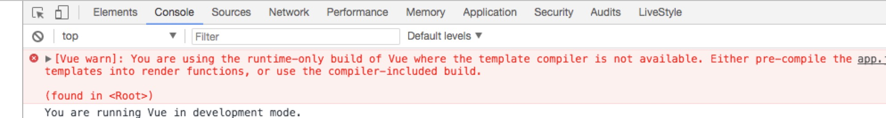

vue-loader配置
=====

要处理`.vue`文件我们需要添加`vue-loader`。

添加`vue-loader`需要提前安装这`css-loader`和`vue-template-compiler`，先简单写一个vue组件并运行起应用。

``` js
rules: [
  // ...
  {
    test: /\.vue$/,
    loader: 'vue-loader',
    options: {
      loaders: {
        css: ['vue-style-loader',
          { loader: 'css-loader' }
        ]
      }
    }
  }
]
```

``` js
// src/index.js
import Vue from 'vue'
import App from './App.vue'

/* eslint-disable no-new */
new Vue({
  el: '#app',
  template: '<App/>',
  components: { App }
})
```

``` html
<!-- src/App.vue -->
<template>
  <div id="app">
    <p>{{msg}}</p>
  </div>
</template>

<script>
export default {
  name: 'app',
  data () {
    return {
      msg: 'Hello world'
    }
  }
}
</script>

<style>
#app {
  font-family: 'Avenir', Helvetica, Arial, sans-serif;
}
</style>
```


`css-loader` 可以解读(interpret)样式代码中的`@import` 和 `url()`，然后会`import/require()`后再解析(resolve)它们。
如果`import/require`到的是引用资源（如images、fonts等）将交由`file-loader`和 `url-loader`处理, 下面是一些配置示例，更多`css-loader`配置选项[查看这里](https://doc.webpack-china.org/loaders/css-loader/#import)

``` js
{
  loader: 'css-loader',
  options: {
    root: '/', // 解析 URL 的路径，以 / 开头的 URL 不会被转译, 默认值为 '/'
    url: true, // 启用/禁用 url() 处理, 默认为 true 
    import: true // 启用/禁用 @import 处理, 默认为 true
    sourceMap: false // 启用/禁用 Sourcemap, 默认为 false
    // ...
  }
}
```

`vue-style-loader` 是一个基于`style-loader`的分支。与`style-loader`类似，与`css-loader`链接起来使用可以将 `css-loader` 的结果（CSS字符串）作为`<style>`标签动态插入到文档中。

上面我们完成了**`*.vue` 文件的`<style>`中样式处理**

# Vue的运行时构建方式 vs 独立构建

完成上诉配置后，运行后发现会浏览器会报错：



意思即当前用的是Vue的运行时构建方式，这种方式是默认不包含template编译的(在`node_modules/vue`目录下，可以看到`package.json`中`main`的值为`dist/vue.runtime.common.js`)。

给出的建议是可以使用预编译(自己写编译template的render函数)，也可以使用包含template编译功能的构建方式(独立构建)。 

这里我们使用后者-**独立构建方式**, 在`webpack.base.conf.js`添加别名：

``` js
resolve: {
  alias: {
    // 配置别名指向独立构建方式需要使用的vue文件
    // vue.esm.js: 基于 ES Module 的独立构建
    'vue$': 'vue/dist/vue.esm.js',
    // 或者使用基于 CommonJS 的独立构建 
    // 'vue$': 'vue/dist/vue.common.js',
  },
  // 我们顺便添加了extensions选项，以便我们require()/import时可以省略以下下后缀名
  extensions: ['.js', '.vue', '.json'],
},
```

完成以上步骤基本完成了对`.vue`文件编译的基本配置，因为之前我们在配置eslint时，在`.eslintrc.js`的`plugins`选项中添加了`eslint-plugin-html`插件，`.vue`文件中`<script>`的js代码也能进行eslint校验。

# 支持less 等样式预处理器

vue-loader 支持使用非默认语言，比如 CSS 预处理器，预编译的 HTML 模版语言，通过设置语言块的 lang 属性。比如`<style lang="less">`, 这里我们就以配置`less`为例：

`npm i --save-dev less less-loader`

在`build/webpack.base.conf.js`的`vue-loader`的`options.loaders`添加`less`选项，如下：

``` js
{
  test: /\.vue$/,
  loader: 'vue-loader',
  options: {
    loaders: {
      css: ['vue-style-loader',
        { loader: 'css-loader', options: { sourceMap: sourceMapEnabled } }
      ],
      less: ['vue-style-loader',
        { loader: 'css-loader', options: { sourceMap: sourceMapEnabled } },
        { loader: 'less-loader', options: { sourceMap: sourceMapEnabled } }
      ]
    }
  }
}
```

然后我们在就可以使用`<style lang="less">`边在里面使用`less`语法了，其他比如`sass`,`stylus`配置类似的添加即可

eg:

``` js
loaders: {
  css: ['vue-style-loader',
    { loader: 'css-loader'}
  ],
  less: ['vue-style-loader',
    { loader: 'css-loader'},
    { loader: 'less-loader'}
  ],
  sass: ['vue-style-loader',
    { loader: 'css-loader'},
    { loader: 'sass-loader'}
  ],
  stylus: ['vue-style-loader',
    { loader: 'css-loader' },
    { loader: 'stylus-loader' }
  ],
}
```