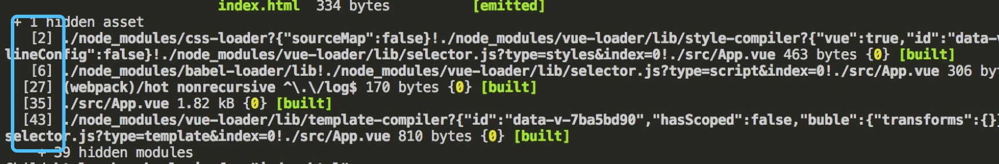
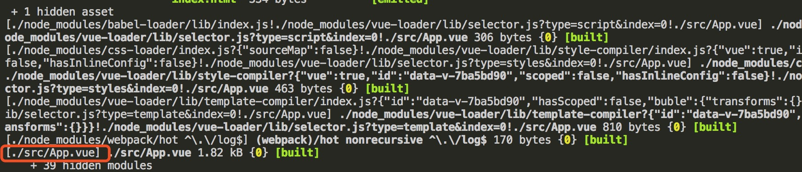

开发环境其他优化配置
=====

### NoEmitOnErrorsPlugin

在编译出现错误时，使用 NoEmitOnErrorsPlugin 来跳过输出阶段。这样可以确保输出资源不会包含错误
如果你在使用 CLI(命令行界面command-line interface)，启用此插件后，webpack 进程遇到错误代码将不会退出

``` js
plugins: [
  new webpack.NoEmitOnErrorsPlugin()
]
```

### NamedModulesPlugin

``` js
plugins: [
  new webpack.NamedModulesPlugin()
]
```

`NamedModulesPlugin`会显示模块的相对路径（包含文件名），而不是文件的id，以便更容易查看要修补(patch)的依赖。我们看一下添加`NamedModulesPlugin`前后 模块显示方式 对比：





### 自动检索可用端口

webpack 允许导出一个 `Promise` ，替代了导出单个配置对象的方式，可以满足一些其他的需求

下面我们将开发环境的 webpack 配置对象导出了一个`Promise`对象, Promise内部使用`portfinder`判断当前端口是否可用，被占用则自动检索并获取下一个可用端口，如果获取失败则`reject()`一个`error`对象，成功则`resolve()` `devWebpackConfig` 配置对象，示例如下：

安装依赖：`npm i --save-dev friendly-errors-webpack-plugin portfinder node-notifier`

``` js
// webpack.dev.conf.js

module.exports = new Promise((resolve, reject) => {
  // 获取当前设定的端口
  portfinder.basePort = process.env.PORT || config.dev.port
  portfinder.getPort((err, port) => {
    if (err) {
      reject(err)
    } else {
      // 发布新的端口
      process.env.PORT = port
      // 设置 devServer 端口
      devWebpackConfig.devServer.port = port
      // FriendlyErrorsPlugin：能够更好在终端看到webapck运行的警告和错误
      devWebpackConfig.plugins.push(new FriendlyErrorsPlugin({
        // 编译成功提醒
        compilationSuccessInfo: {
          messages: [`Your application is running here: http://${devWebpackConfig.devServer.host}:${port}`],
        },
        // 此处为 notifyOnErrors 设置 true
        onErrors: config.dev.notifyOnErrors
        ? utils.createNotifierCallback()
        : undefined
      }))

      resolve(devWebpackConfig)
    }
  })
})
```

在`builds/utils.js`添加并暴露`createNotifierCallback`方法，代码如下：

``` js
const path = require('path')
const config = require('../config')
const packageConfig = require('../package.json')

// ...

exports.createNotifierCallback = () => {
  // 可发送跨平台通知, 基本用法：notifier.notify('message')
  const notifier = require('node-notifier')
  return (severity, errors) => {
    // 当前设定是只有出现 error 错误时触发 notifier 发送通知
    // 严重程度可以是 'error' 或 'warning'
    if (severity !== 'error') return

    const error = errors[0]
    const filename = error.file && error.file.split('!').pop()

    notifier.notify({
      title: packageConfig.name,
      message: severity + ': ' + error.name,
      subtitle: filename || '',
      // 通知图标
      icon: path.join(__dirname, 'logo.png')
    })
  }
}
```

**notifier通知**

[notifier 跨平台通知](./images/notifier.jpeg)