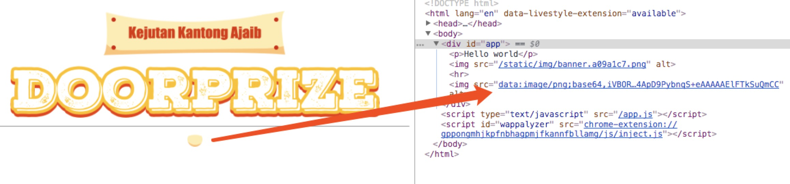

常用loader配置
=========

loader的配置中，我们把css 和 `.vue`文件的加载配置放到一起，先把其他一些静态资源的加载器配置了。

之前已经设置了打包后资源都输出到`dist`目录下，现在目标是把较大的文件资源我们就存放在`dist/static/`目录下，并按资源分类建立子目录存放，比如images资源我们就打包到`dist/static/images`下，比较小的资源文件直接转换为 DataURL，这样可以减少请求次数。

这需要使用`url-loader`，`file-loader`来实现：

`file-loader` 将文件输出到输出目录并返回 public URL, 如 `"/public/path/0dcbbaa7013869e351f.png"`；

`url-loader` 功能类似于 `file-loader`，但是在文件大小（单位 byte）低于指定的限制时（设置`options.limit`选项），可以返回一个 DataURL。

``` js
const assetsSubDirectory = 'static'
const assetsPath = function (_path) {
  // path.posix 属性提供了 path 方法针对 POSIX 的实现
  return path.posix.join(assetsSubDirectory, _path)
}
{
  test: /\.(png|jpe?g|gif|svg)(\?.*)?$/,
  loader: 'url-loader',
  options: {
    limit: 10000,
    name: assetsPath('img/[name].[hash:7].[ext]')
  }
}
```




bundle资源输出路径，静态资源路径，发布路径等配置需要独立出来，我们创建config模块并区分开发、生产环境：

``` js
module.exports = {
  dev: {
    // ...
    publicPath: '/',
    assetsSubDirectory: 'static',
  },
  build: {
    // ...
    assetsRoot: path.resolve(__dirname, '../dist'),
    publicPath: '/',
    assetsSubDirectory: 'static'
  }
}
```

因为其他如字体，媒体等资源的`options.name`配置都是统一的，我们**封装assetsPath函数**做来这件事：
新建`build/utils.js`,暴露`assetsPath`方法：

``` js
'use strict'
const path = require('path')
const config = require('../config')

exports.assetsPath = function (_path) {
  const assetsSubDirectory = process.env.NODE_ENV === 'production'
    ? config.build.assetsSubDirectory
    : config.dev.assetsSubDirectory
  // `path.posix` 属性提供了 path 方法针对 POSIX 的实现
  return path.posix.join(assetsSubDirectory, _path)
```

- 其他

``` js
{
  test: /\.(mp4|webm|ogg|mp3|wav|flac|aac)(\?.*)?$/,
  loader: 'url-loader',
  options: {
    limit: 10000,
    name: utils.assetsPath('media/[name].[hash:7].[ext]')
  }
},
{
  test: /\.(woff2?|eot|ttf|otf)(\?.*)?$/,
  loader: 'url-loader',
  options: {
    limit: 10000,
    name: utils.assetsPath('fonts/[name].[hash:7].[ext]')
  }
}
```