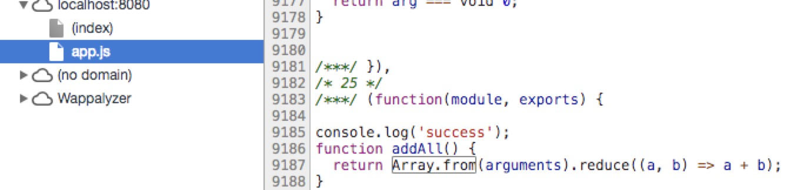
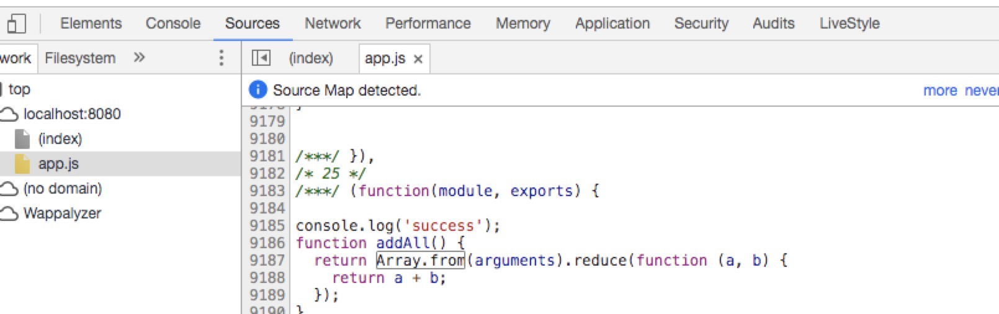
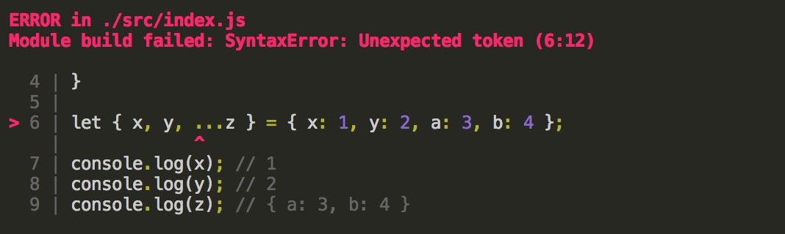
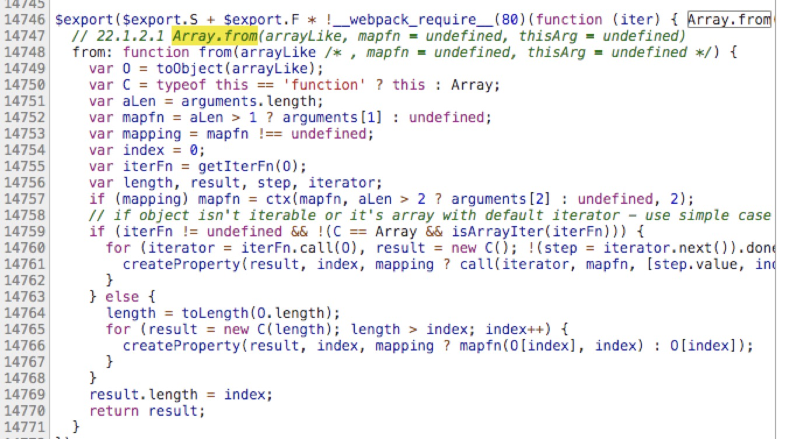

Babel使用
====

1. 添加 webpack 配置

需要安装`babel-core`、`babel-loader`: `npm i --save-dev babel-core babel-loader`

添加 `module` 选项并加入`babel-loader`配置：

``` js
/* webpack.base.conf.js */

module.exports = {
  // ...
  module: {
    rules: [
      {
        test: /\.js$/,
        loader: 'babel-loader',
        include: [resolve('src'), resolve('test')]
      }
    ]
  }
  // ...
}

```

在`src/index.js`中写入如下代码：

```js
function addAll() {
  return Array.from(arguments).reduce((a, b) => a + b);
}
```
重新运行项目，浏览器开发者工具`Sources`标签页查看app.js，会发现addAll函数并没有被编译，也就是说`Babel`什么都没有做：



### 添加 Babel 选项

实际 Babel 默认的确就是什么也不做的，需要添加安装并配置插件（plugins）或预设（presets，也是一组插件）。而给 Babel 传递配置选项， `.babelrc` 文件是约定也是最好的方式：

在项目根目录添加`.babelrc`文件，添加如下内容：

1. ES6 转 ES5

ES2015：最新版本的 JavaScript 标准，也叫ES6；
ES5： 现今在大多数 JavaScript 环境下可用的版本

这里我们就是要把ES6 转换成 大多数JavaScript 环境下可用的版本，配置如下

安装 "es2015" Babel 预设： `npm i --save-dev babel-preset-es2015`

``` json
{
  "presets": [
    "es2015"
  ],
  "plugins": []
}
```
重新运行项目后查看`app.js`文件发现箭头函数已经被编译成匿名函数的写法了：



2. 支持 JavaScript提案 编译

JavaScript 还有一些提案，正在积极通过 TC39（ECMAScript 标准背后的技术委员会）的流程成为标准的一部分。

这个流程分为 5（0－4）个阶段。 随着提案得到越多的关注就越有可能被标准采纳，于是他们就继续通过各个阶段，最终在阶段 4 被标准正式采纳

> 注意 stage-4 预设是不存在的, 因为它就是上面的 es2015 预设

以上每种预设都依赖于紧随的后期阶段预设。例如，babel-preset-stage-1 依赖 babel-preset-stage-2，后者又依赖 babel-preset-stage-3。

也就是说 babel-preset-stage-1 包含了 babel-preset-stage-2， babel-preset-stage-2 包含了 babel-preset-stage-3

使用的时候只需要安装你想要的阶段就可以了，eg `npm install --save-dev babel-preset-stage-2`

这里我们先安装`babel-preset-stage-3`, 配置如下

``` json
{
  "presets": [
    "es2015",
    "stage-2"
  ],
  "plugins": []
}
```

stage-2 支持 扩展运算符，我们在`src/index.js`中添加

``` js
let { x, y, ...z } = { x: 1, y: 2, a: 3, b: 4 };
console.log(x); // 1
console.log(y); // 2
console.log(z); // { a: 3, b: 4 }
```
发现在 presets 选项只添加了`"es2015"`时无法编译，webpack会在终端显示`SyntaxError: Unexpected token` 的错误，无法识别 `...`运算符：




添加`"stage-2"`后就可以成功编译了

3. 编译新的JavaScript APIs

Babel 几乎可以编译所有时新的 JavaScript 语法，但对于 APIs 来说却并非如此。

`Array.from`是一个新的API，看编译后的结果可能发现`Array.from`并没有被编译,同时也没有添加Array.from的定义，如果再低版本的环境下，会出Array.from 不是一个方法的错误，

为了解决这些新的APIs的问题，我们使用 Polyfill（代码填充，也可译作兼容性补丁）的技术，补充新Apis的方法定义：

安装`babel-polyfill`, `npm install --save babel-polyfill`

在`src/index.js`的头部添加 `import 'babel-polyfill'`

重新运行后可能发现`app.js`中添加了很多补丁方法，其中就有Array.from的声明



4. babel-preset-env

babel官方最新推荐是使用babel-preset-env。可以根据浏览器版本之类的自动加载插件

``` json
{
  "presets": [
    ["env", {
      "modules": false
    }],
    "stage-2"
  ],
  "plugins": []
}
```

5. transform-runtime

https://segmentfault.com/q/1010000005596587?from=singlemessage&isappinstalled=1

Babel 转译后的代码要实现源代码同样的功能需要借助一些帮助函数

例如，{ [name]: 'JavaScript' } 转译后的代码:

``` js
'use strict';
function _defineProperty(obj, key, value) {
  if (key in obj) {
    Object.defineProperty(obj, key, {
      value: value,
      enumerable: true,
      configurable: true,
      writable: true
    });
  } else {
    obj[key] = value;
  }
  return obj;
}
var obj = _defineProperty({}, 'name', 'JavaScript');
```

类似上面的帮助函数 _defineProperty 可能会重复出现在一些模块里，导致编译后的代码体积变大。Babel 为了解决这个问题，提供了单独的包 babel-runtime 供编译模块复用工具函数。

启用插件 babel-plugin-transform-runtime 后，Babel 就会使用 babel-runtime 下的工具函数，转译代码如下

``` js
'use strict';
// 之前的 _defineProperty 函数已经作为公共模块 `babel-runtime/helpers/defineProperty` 使用
var _defineProperty2 = require('babel-runtime/helpers/defineProperty');
var _defineProperty3 = _interopRequireDefault(_defineProperty2);
function _interopRequireDefault(obj) { return obj && obj.__esModule ? obj : { default: obj }; }
var obj = (0, _defineProperty3.default)({}, 'name', 'JavaScript');

```

``` 
npm install --save-dev babel-plugin-transform-runtime
npm install --save babel-runtime
```

`"transform-runtime"` 添加到 `.babelrc` `plugins` 选项

``` json
{
  "plugins": ["transform-runtime"],
}
```